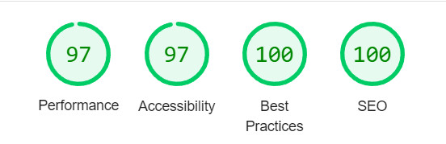

# Frontend Mentor - Project tracking intro component solution

This is a solution to the [Project tracking intro component challenge on Frontend Mentor](https://www.frontendmentor.io/challenges/project-tracking-intro-component-5d289097500fcb331a67d80e). Frontend Mentor challenges help you improve your coding skills by building realistic projects. 

## Table of contents

- [Overview](#overview)
  - [The challenge](#the-challenge)
  - [Screenshot](#screenshot)
  - [Links](#links)
- [My process](#my-process)
  - [Built with](#built-with)
  - [What I learned](#what-i-learned)
  - [Continued development](#continued-development)
  - [Useful resources](#useful-resources)
- [Author](#author)
- [Acknowledgments](#acknowledgments)

## Overview

### The challenge

Users should be able to:

- View the optimal layout for the site depending on their device's screen size
- See hover states for all interactive elements on the page
- Create the background shape using code

### Screenshot

 

### Links

- Solution URL: (https://github.com/yuvan05/Frontend-Project-tracking-intro-component)
- Live Site URL: (https://Frontend-Project-tracking-intro-component.yuvan05.repl.co)

## My process

### Built with

- Semantic HTML5 markup
- CSS custom properties
- Flexbox
- CSS Grid
- Bem
- JS

### What I learned
I started to feel much more comfortable using CSS Grid and flexbox together. It helped a lot when I had to aline the header and main containers on the left side.

## Author

- Website - [Yuvan](https://github.com/yuvan05/Frontend-Project-tracking-intro-component)
- Frontend Mentor - [@Yuvan05](https://www.frontendmentor.io/profile/yuvan05)

